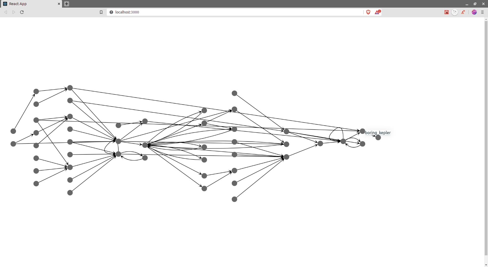

# Lineage
Tokern Lineage is an open source application to query and visualize data lineage in databases, data warehouses and
data lakes in AWS and GCP. 

# Features

* Generate lineage from SQL query history.
* Supports ANSI SQL queries
* Select source or target table.
* Pan, Zoom, Select graph
* Customize graph and tool tips with custom CSS.

# Supported Databases

* AWS Redshift
* AWS Athena
* MySQL/MariaDb
* PostgreSQL

# Installation

# Installation

Bastion has multiple installation options. For a quick start, follow the
instructions below:

## Docker Compose

    docker-compose -f docker/docker-compose.yml -p lineage up

The command starts up a self contained service consisting of the Lineage app.

## Docker 

    docker run -d -p 3646:3646 \
        --env LINEAGE_QUERY_HISTORY=<path to query history file> \
        tokern/lineage:latest

# Next Steps
Visit http://localhost:3646 to start using the application.

# Documentation
Visit [Lineage documentation](https://tokern.io/docs/lineage) to deploy and use in
production to protect databases in AWS, GCP or your data center.

Visit [Lineage - Data Lineage](https://tokern.io/lineage) page for features and use cases.

